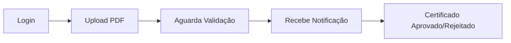
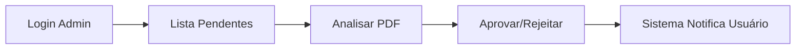

# 🎯 NextEvent - Sistema de Gestão de Certificados

<div align="center">


Um sistema completo para gestão e validação de certificados acadêmicos/profissionais com notificações em tempo real.

</div>

---

## � **Visão Geral**

O **NextEvent** é uma plataforma que permite:

- 👤 **Participantes** fazem upload de certificados em PDF
- 👨‍💼 **Administradores** validam (aprovam/rejeitam) os certificados  
- 🔔 **Sistema** envia notificações automáticas sobre mudanças de status
- 📊 **Relatórios** detalhados de certificados por período
- 🔐 **Autenticação JWT** com controle de permissões baseado em roles

---

## 🏗️ **Arquitetura**

O projeto segue os princípios da **Clean Architecture**:

```
src/
├── domain/              # Regras de negócio e entidades
│   ├── user/           # Domínio de usuários
│   ├── certificate/    # Domínio de certificados  
│   └── notification/   # Domínio de notificações
├── application/        # Casos de uso da aplicação
├── infrastructure/     # Implementações técnicas (BD, repos)
└── presentation/       # Controllers, rotas e middlewares
```

**Stack Tecnológica:**
- **Backend**: Node.js + TypeScript + Express.js
- **Database**: PostgreSQL + Prisma ORM  
- **Auth**: JWT (JSON Web Tokens)
- **Upload**: Multer (arquivos PDF)
- **Container**: Docker + Docker Compose

---

## � **Funcionalidades**

### ✅ **Sistema de Usuários**
- [x] Cadastro e autenticação JWT
- [x] Roles: `participant` e `admin`  
- [x] Middleware de autorização
- [x] Gestão de perfil

### ✅ **Gestão de Certificados**  
- [x] Upload de arquivos PDF
- [x] Metadados: título, instituição, carga horária, período
- [x] Status: `pending`, `approved`, `rejected`
- [x] Comentários do administrador
- [x] Listagem com filtros

### ✅ **Sistema de Notificações**
- [x] Notificações automáticas na validação
- [x] Contagem de não lidas
- [x] Marcar como lida (individual/em lote)
- [x] Tipos: aprovação, rejeição, anúncios

### ✅ **APIs RESTful**
- [x] Endpoints documentados
- [x] Validação de dados
- [x] Tratamento de erros
- [x] Paginação e filtros

---

## �️ **Instalação e Setup**

### **Pré-requisitos**
- Node.js 18+
- Docker e Docker Compose
- Git

### **1. Clonar o Repositório**
```bash
git clone https://github.com/Iarafarias/Next-Event.git
cd NextEvent
```

### **2. Instalar Dependências**
```bash
npm install
```

### **3. Configurar Ambiente**
```bash
# Copiar variáveis de ambiente
cp .env.example .env

# Editar as configurações necessárias
nano .env
```

### **4. Iniciar Banco de Dados**
```bash
# Subir PostgreSQL com Docker
cd database
docker-compose up -d

# Voltar para raiz do projeto
cd ..
```

### **5. Configurar Banco**
```bash
# Aplicar migrações
npx prisma migrate dev

# Gerar cliente Prisma
npx prisma generate

# (Opcional) Popular com dados de exemplo
npx prisma db seed
```

### **6. Executar Aplicação**
```bash
# Desenvolvimento
npm run dev

# Produção
npm run build
npm start
```

**🎉 Aplicação rodando em:** `http://localhost:3000`

---

## 🔌 **API Reference**

### **Base URL**: `http://localhost:3000/api`

### **Autenticação**
```http
POST /users/login
POST /users (criar usuário)
GET  /users/me (dados do usuário logado)
```

### **Certificados**
```http
POST   /certificates/upload          # Upload de certificado
GET    /certificates/user/{userId}   # Certificados do usuário  
PATCH  /certificates/{id}/status     # Validar certificado (ADMIN)
DELETE /certificates/{id}            # Deletar certificado
```

### **Notificações**
```http
GET    /notifications                # Listar notificações
GET    /notifications/unread-count   # Contar não lidas
PATCH  /notifications/{id}/read      # Marcar como lida
PATCH  /notifications/mark-all-read  # Marcar todas como lidas
```

**� Documentação completa:** [API_REFERENCE.md](./API_REFERENCE.md)

---

## 👨‍💻 **Para Desenvolvedores Frontend**

### **Documentação Disponível:**
- 📚 **[FRONTEND_DOCS.md](./FRONTEND_DOCS.md)** - Guia completo de desenvolvimento
- 🔧 **[FRONTEND_SETUP.md](./FRONTEND_SETUP.md)** - Setup do projeto React/Vue
- 🗄️ **[DATABASE_SCHEMA.md](./DATABASE_SCHEMA.md)** - Esquema do banco de dados

### **Stack Frontend Recomendada:**
- React 18 + TypeScript + Vite
- Material-UI ou Ant Design  
- React Query (cache de API)
- React Hook Form (formulários)
- Zustand (gerenciamento de estado)

---

## 🐳 **Docker**

### **Executar com Docker:**
```bash
# Apenas banco de dados
docker-compose -f database/docker-compose.yml up -d

# Aplicação completa (futuro)
docker-compose up -d
```

### **Configuração do PostgreSQL:**
- **Host**: `localhost`
- **Porta**: `5433`
- **Database**: `nextevent_db`
- **Usuário**: `nextevent_user`  
- **Senha**: `nextevent_password`

---

## 🧪 **Testes**

```bash
# Executar testes unitários
npm test

# Cobertura de testes
npm run test:coverage

# Testes de integração
npm run test:integration
```

---

## � **Banco de Dados**

### **Tabelas Principais:**
```sql
users          # Usuários (participantes e admins)  
certificates   # Certificados enviados
notifications  # Notificações do sistema

---

---

## 🔄 **Fluxo de Trabalho**

### **1. Participante**


### **2. Administrador**


---

## 🎯 **Roadmap**

### **Versão Atual (v1.0)**
- ✅ CRUD completo de usuários
- ✅ Upload e validação de certificados  
- ✅ Sistema de notificações
- ✅ APIs RESTful documentadas

---

## 🤝 **Contribuição**

1. **Fork** o projeto
2. **Clone** sua fork
3. Crie uma **branch** para sua feature: `git checkout -b feat/nova-feature`
4. **Commit** suas mudanças: `git commit -m 'Add nova feature'`  
5. **Push** para branch: `git push origin feat/nova-feature`
6. Abra um **Pull Request**

### **Padrão de Commits:**
```
feat: nova funcionalidade
fix: correção de bug  
docs: documentação
refactor: refatoração de código
test: testes
chore: tarefas de manutenção
```

---

## 👥 **Autores**

- **Iara Farias** - [@Iarafarias](https://github.com/Iarafarias)

---

## 📞 **Suporte**

- 🐛 **Issues**: [GitHub Issues](https://github.com/Iarafarias/Next-Event/issues)
- 📧 **Email**: iarafarias@exemplo.com
- 💬 **Discussões**: [GitHub Discussions](https://github.com/Iarafarias/Next-Event/discussions)

---

<div align="center">

**⭐ Se este projeto foi útil, deixe uma estrela!**

</div>
