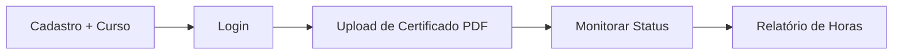
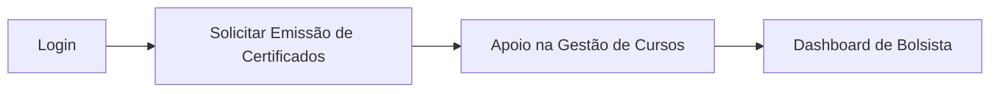
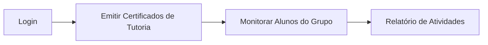
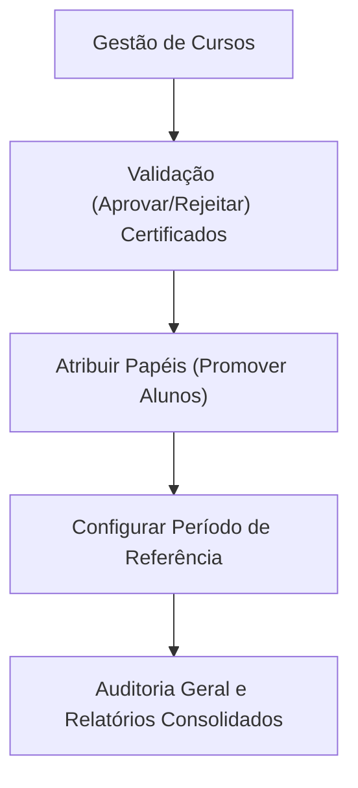

# 🚀 NextCertify - Sistema de Gestão de Certificados e Tutoria

Sistema completo para gerenciamento de certificados acadêmicos, tutoria de alunos e relatórios administrativos usando Clean Architecture.

## 📋 Swagger UI (Documentação Interativa)

Após iniciar o servidor, acesse:
`http://localhost:3000/api-docs`

para visualizar e testar todos os endpoints da API de forma interativa. A documentação é gerada automaticamente a partir do arquivo `openapi.yaml`.

---

## 📁 Estrutura do Projeto (Clean Code)

O **NextCertify** é uma plataforma que permite:

- 🎓 **Alunos**: Realizam upload de certificados externos em PDF, acompanham o status de validação e geram relatórios de carga horária para atividades complementares.
- 👨‍ **Tutores**: Emitem certificados de tutoria para seus alunos, monitoram o progresso do grupo e gerenciam atividades acadêmicas específicas.
- 💰 **Bolsistas**: Atuam no apoio administrativo, solicitando emissão de certificados, auxiliando na gestão de cursos e monitorando fluxos do sistema.
- 🏛️ **Coordenadores**: Possuem poder de auditoria total, validam certificados externos, gerenciam o cadastro de cursos e promovem alunos aos papéis de bolsista ou tutor.
- 📊 **Gestão Inteligente**: Geração de relatórios detalhados, controle de carga horária mínima por curso e notificações automáticas de status.
- 🔐 **Segurança**: Autenticação JWT robusta com controle de acesso baseado em múltiplos papéis (Roles).

---

## 🏗️ **Arquitetura**

O projeto segue os princípios da **Clean Architecture**:

```
src/
├── domain/              # Regras de negócio e entidades
│   ├── user/           # Domínio de usuários
│   ├── aluno/          # NOVO: Domínio de perfis acadêmicos
│   ├── curso/          # NOVO: Domínio de cursos
│   ├── certificate/    # Domínio de certificados  
│   └── notification/   # Domínio de notificações
├── application/        # Casos de uso da aplicação
├── infrastructure/     # Implementações técnicas (BD, repos)
└── presentation/       # Controllers, rotas e middlewares
```

**Stack Tecnológica:**
- **Backend**: Node.js + TypeScript + Express.js
- **Database**: PostgreSQL + Prisma ORM  
- **Auth**: JWT (JSON Web Tokens)
- **Documentação**: OpenAPI 3.0 (Swagger)
- **Container**: Docker + Docker Compose

---

## ⚙️ **Funcionalidades**

### ✅ **Sistema de Usuários e Perfis**
- [x] Cadastro integrado (Criação automática de perfil Aluno)
- [x] Autenticação JWT com retorno de Roles
- [x] Roles: `student`, `tutor`, `scholarship_holder`, `coordinator`
- [x] Gestão de cursos e vínculo acadêmico

### ✅ **Gestão de Certificados**  
- [x] Upload de arquivos PDF (via Multer)
- [x] Metadados: título, instituição, carga horária, período
- [x] Fluxo de aprovação: `pending`, `approved`, `rejected`
- [x] Relatórios mensais e por usuário

### ✅ **Sistema de Notificações**
- [x] Notificações automáticas na validação de certificados
- [x] Gestão de leitura (marcar individual ou em lote)
- [x] Contagem de notificações não lidas

---

## 🔌 **API Reference**

### **Autenticação & Usuários**
```http
POST /api/users        # Cadastro (Usuario + Aluno)
POST /api/users/login  # Login (Retorna Token e Role)
PATCH /api/users/{id}/atribuir-papel # Atribuir papel a usuário
```

### **Cursos (Gestão Acadêmica)**
```http
GET  /api/cursos       # Listar cursos (Público)
POST /api/cursos       # Criar novo curso (Admin)
PUT  /api/cursos/{id}  # Editar curso
```

### **Alunos**
```http
GET  /api/alunos       # Listar alunos e seus cursos
GET  /api/alunos/{id}  # Detalhes do perfil acadêmico
```

### **Certificados**
```http
POST /api/certificates/upload          # Upload de PDF
GET  /api/certificates/user/{userId}   # Lista por usuário
PATCH /api/certificates/{id}/status    # Validar (Admin)
GET  /api/certificates/report          # Gerar relatório
```

**📄 Documentação detalhada:** [API_REFERENCE.md](./docs/API_REFERENCE.md)

---

## 🛠️ **Instalação e Setup**

1. **Instalar Dependências**: `npm install`
2. **Configurar Ambiente**: Criar `.env` baseado no `.env.example`
3. **Subir Banco de Dados**: `cd database && docker compose up -d`
4. **Migrações Prisma**: `npx prisma migrate dev`
5. **Iniciar Servidor**: `npm run dev` (Acessível em `http://localhost:3000`)

---

## 🐳 **Docker**

### **Executar com Docker:**
```bash
# Apenas banco de dados
docker compose -f database/docker-compose.yml up -d

# Aplicação completa
docker compose up --build -d
```

### **Configuração do PostgreSQL:**
- **Host**: `localhost`
- **Porta**: `5433`
- **Database**: `nextevent_db`
- **Usuário**: `nextevent_user`  
- **Senha**: `nextevent_password`

---

## 🧪 **Testes**

```bash
# Executar testes unitários
npm test

# Cobertura de testes
npm run test:coverage

# Testes de integração
npm run test:integration
```

---

## 🧪 **Banco de Dados**

### **Tabelas Principais:**
- `users`: Credenciais e dados de acesso.
- `alunos`: Perfil acadêmico (matrícula, curso, role interna).
- `cursos`: Cadastro de cursos da instituição.
- `certificates`: Arquivos e metadados de certificados.
- `notifications`: Alertas do sistema.

---

## 🔄 **Fluxo de Trabalho por Papel**

O sistema NextCertify opera com quatro fluxos principais de usuário, cada um com permissões e objetivos específicos:

### **1. 🎓 Aluno (Perfil Base)**
Todo usuário inicia como Aluno ao se cadastrar e vincular-se a um curso.


### **2. 💰 Bolsista (Apoio Administrativo)**
Alunos promovidos a Bolsistas possuem acesso a ferramentas de solicitação e gestão de eventos.


### **3. 👨‍🏫 Tutor (Gestão Acadêmica)**
Responsável por acompanhar o desenvolvimento dos alunos e validar atividades de tutoria.


### **4. 🛡️ Coordenador (Administrador do Sistema)**
Detém o poder de auditoria final, validação de certificados externos e gestão de toda a hierarquia.


---

## 🎯 **Roadmap**

### **Versão Atual (v1.0)**
- ✅ CRUD completo de usuários
- ✅ Gestão de Cursos e vínculos acadêmicos
- ✅ Upload e validação de certificados
- ✅ Sistema de notificações automáticas
- ✅ APIs RESTful documentadas (Swagger)

---

## 🤝 **Contribuição**

1. **Fork** o projeto
2. **Clone** sua fork
3. Crie uma **branch** para sua feature: `git checkout -b feat/nova-feature`
4. **Commit** suas mudanças: `git commit -m 'Add nova feature'`  
5. **Push** para branch: `git push origin feat/nova-feature`
6. Abra um **Pull Request**

### **Padrão de Commits:**
`feat:`, `fix:`, `docs:`, `refactor:`, `test:`, `chore:`

---

## 👥 **Autores**

- **Iara Farias** - [@Iarafarias](https://github.com/Iarafarias)

<div align="center">
**⭐ Se este projeto foi útil, deixe uma estrela!**
</div>
