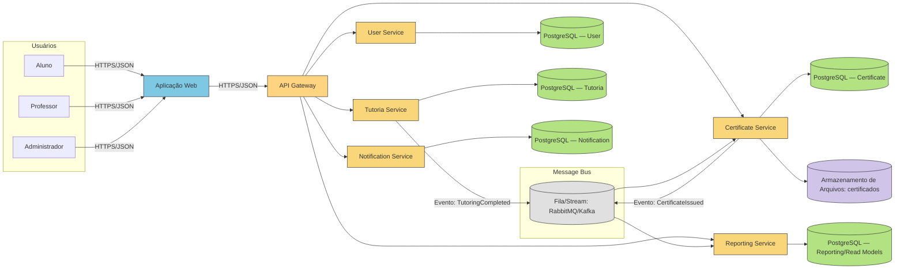

# Next-Event — Evolução para Microsserviços

## Bounded Contexts

- **User**: cadastro, perfis, autenticação/autorização. Diretórios correlatos: `src/domain/user`, `src/application/user`, `src/infrastructure/user`.
- **Tutoria**: regras de período de tutoria, alocação tutor-aluno, carga horária mínima, formulários de acompanhamento. Diretórios: `src/domain/periodoTutoria`, `src/domain/alocarTutorAluno`, `src/domain/cargaHorariaMinima`, `src/domain/formAcompanhamento` e equivalentes em `application`/`infrastructure`.
- **Certificate**: emissão, validação e armazenamento de certificados. Diretórios: `src/domain/certificate`.
- **Notification**: envio de notificações e integrações (e-mail, push). Diretórios: `src/domain/notification`.
- **Reporting**: relatórios (aluno, avaliação, tutor, certificados, acompanhamento). Diretórios: `src/domain/relatorio*`.
- **Event**: gestão de eventos/inscrições, se aplicável. Diretórios: `src/domain/event`.
- **File Storage**: arquivos e certificados em `uploads/` (pode virar serviço de mídia).

## Autonomia dos Serviços

- **Deploy independente**: cada serviço é um processo isolado (ex.: Node.js/Express) com seu pipeline, podendo escalar horizontalmente.
- **Banco por serviço**: esquemas/dados próprios, evitando shared-database. Interações via API/Eventos.
- **Contrato explícito**: REST/JSON (OpenAPI) para consultas/comandos; mensagens assíncronas para eventos de domínio (ex.: `CertificateIssued`).
- **Observabilidade**: logs, métricas e tracing por serviço; correlação por `traceId` entre requisições/eventos.
- **Resiliência**: timeouts, retries, circuito aberto, idempotência em consumidores; filas como buffer.

## Divisão dos Dados (Justificativa)

- **Acoplamento reduzido**: mudanças no `Tutoria` não quebram `Certificate`/`Reporting`.
- **Modelos específicos**: cada contexto otimiza seu modelo (ex.: `Tutoria` com regras de período; `Certificate` com estado da emissão).
- **Escalabilidade direcionada**: serviços com maior volume (ex.: `Reporting`) podem ter réplicas/leitura sem afetar gravações.
- **Autonomia operacional**: backups/restaurações por contexto; políticas de retenção distintas.
- **Integração via eventos**: `Tutoria` publica `TutoringCompleted`; `Certificate` consome e emite `CertificateIssued`; `Reporting` mantém projeções (CQRS/read models) para consultas agregadas.

## Diagrama de Contêiner — Microsserviços (Mermaid)

## SOA vs Microsserviços

- **Granularidade**: SOA tende a serviços maiores e reutilizáveis; Microsserviços enfatizam unidades pequenas focadas em um contexto de negócio.
- **Integração**: SOA frequentemente usa ESB/mediadores centrais; Microsserviços preferem endpoints simples e "dumb pipes" (HTTP/Message Bus), evitando um ponto único de acoplamento.
- **Dados**: SOA pode compartilhar bancos/entidades comuns; Microsserviços defendem banco por serviço e modelos independentes.
- **Deploy/Governança**: SOA pode ter governança central pesada; Microsserviços privilegiam autonomia de equipe e deploy independente por serviço.
- **Tecnologia**: SOA busca padronização forte; Microsserviços são poliglotas por contexto quando necessário.

## Passos Práticos de Migração

- **1. Isolar Contextos no Monólito**: manter pastas por domínio (já existem) e limitar acoplamentos entre `application` e `domain`.
- **2. Extrair Serviços Gradualmente**: começar por `Notification` e `Certificate` (dependem de eventos) mantendo contratos REST/OpenAPI.
- **3. Introduzir Mensageria**: publicar eventos de domínio e tornar consumidores idempotentes; usar tópicos/fila por evento.
- **4. Banco por Serviço**: criar esquemas distintos (ou instâncias separadas) e migrar dados com scripts de ETL controlados.
- **5. API Gateway**: adicionar roteamento, autenticação (JWT), rate limit e agregações simples.
- **6. Observabilidade**: configurar logs centralizados, métricas e tracing (ex.: OpenTelemetry).
- **7. Hardening**: implementar timeouts, circuit breakers, backoff em chamadas entre serviços.

## Referências do Repositório

- Swagger/OpenAPI: [openapi.yaml](../openapi.yaml).
- Prisma: [prisma/schema.prisma](../prisma/schema.prisma).
- Domínios: veja subpastas em [src/domain](../src/domain) e camadas associadas em `application`/`infrastructure`/`presentation`.
